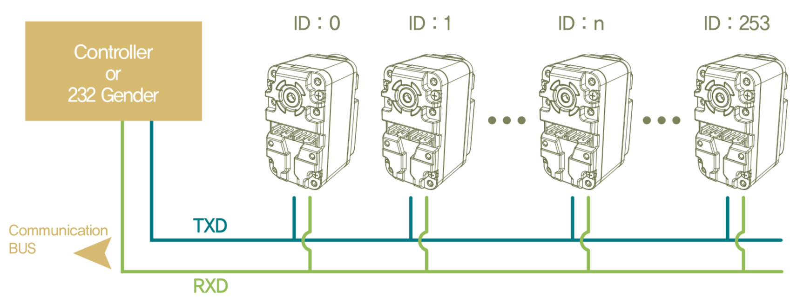

# Servo ID
Each servo on the bus needs to be programmed with an unique ID. This ID is a
number from `0` to `253`. Having multiple servos with the same ID on the same
bus is a recipe for disaster and will cause communication errors. By default,
the servos are programmed with ID 0xFD. You can also determine which IDs are
active on the bus using the [BusScanner sketch](bus-scanner.md). The value of
the ID is stored in EEPROM and can (should) be changed to suit your application.



## Programming the ID

In a typical scenario, you would make sure that the servo to be programmed is
the only device on the bus. You will also need to know the ID the servo is
currently programmed to. You can try the default ID `0xFD` or you can use the
[BusScanner sketch](bus-scanner.md). You can then use that information to write
to the servo's ID register. You will need to write to both EEPROM and RAM
registers in order for the new ID to go into effect immediately. Alternatively,
you can write the ID to EEPROM and then `reboot()` the servo.



Set up servo objects:
```C++
const uint8_t old_id = 0xFD;
const uint8_t new_id = 12;

HerkulexServo servo_old(herkulex_bus, old_id);
HerkulexServo servo_new(herkulex_bus, new_id);
```

Reprogram both RAM and EEPROM registers:
```C++
servo_old.writeEep(HerkulexEepRegister::ID, new_id);
servo_old.writeRam(HerkulexRamRegister::ID, new_id);
```

See if it worked:
```C++
servo_new.setLedColor(HerkulexLed::Green);
```



## Broadcast id

There is a special ID value `0xFE` that all servos will respond to. This value
is defined in the library under the constant `HERKULEX_BROADCAST_ID`. You can
use this ID to issue commands to all servos on the bus.

**However**, certain methods modify the internal state of the `HerkulexServo`
class. Using these methods on a `HERKULEX_BROADCAST_ID` servo object will cause
wonkiness. The following methods are known to cause problems:

- `enablePositionControlMode()`
- `enableSpeedControlMode()`
- `setLedColor()`

**Use with caution!**


Create a broadcast servo instance:
```C++
HerkulexServo all_servos(herkulex_bus, HERKULEX_BROADCAST_ID);
```

Turn all servos on:
```C++
all_servos.setTorqueOn();
```

