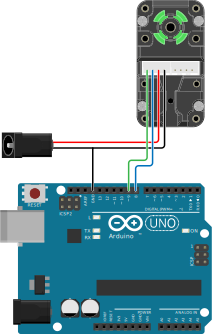

# Tutorial

## Hookup {#hookup}

Connect the servo according to the hookup schematic shown to the left. You will
need an external 7.4V power source to power the servos, e.g. a battery pack or a
lab power supply. Note that Herkulex servos can draw substantial currents, up to
700mA per servo for model DRS-0201. The table below summarizes the connections.

<table>
  <thead>
    <tr>
      <th>Color</th>
      <th>Herkulex</th>
      <th>Arduino</th>
    </tr>
  </thead>
  <tbody>
    <tr>
      <td><div class="color-indicator" style="background-color: #000000;"> </div></td>
      <td>GND</td>
      <td>GND (<em>Note:</em> make sure the power supply ground and Arduino ground are connected.)</td>
    </tr>
    <tr>
      <td><div class="color-indicator" style="background-color: #ff0000;"> </div></td>
      <td>VDD</td>
      <td>7.4V power supply</td>
    </tr>
    <tr>
      <td><div class="color-indicator" style="background-color: #0071bc;"> </div></td>
      <td>TXD</td>
      <td>Pin 8 (SoftwareSerial RX)</td>
    </tr>
    <tr>
      <td><div class="color-indicator" style="background-color: #39b54a;"> </div></td>
      <td>RXD</td>
      <td>Pin 9 (SoftwareSerial TX)</td>
    </tr>
  </tbody>
</table>








## Include the library {#library}

Include the appropriate header files at the top of your sketch.


```C++
#include <SoftwareSerial.h>
#include <CircularBuffer.h>
#include <HerkulexServo.h>
```




## Communication bus setup {#commbus}


The next step is to create a `HerkulexBus` object. This object manages the
communication layer and is shared between all servos. The `HerkulexBus`
constructor takes one parameter: the serial port to use. This can either be a
hardware UART or a software UART. On an Arduino Uno, you may opt
to use a software serial port so that the hardware port can still be used to
communicate with the host computer (e.g. to use the serial monitor).


Using a software serial port on pin 8 (RX) and 9 (TX):
```C++
SoftwareSerial   servo_serial(8, 9); // RX, TX
HerkulexServoBus herkulex_bus(servo_serial);
```

Using one of the 4 hardware serial ports on the Arduino Mega:
```C++
HerkulexServoBus herkulex_bus(Serial1);
```




## Adding servo instances {#servos}

Now that the communication bus is set up, `HerkulexServo` instances can be
added. This object lets you do things with the servo, such as setting its
position or reading its parameters. The `HerkulexServo` constructor takes two
parameters: the `HerkulexBus` instance and the servo ID.

**Note:** Each servo needs to be configured with a unique ID. This value is
stored on the internal EEPROM memory of the servo. Multiple servos with the same
ID on the same bus will cause problems.


Define three servo instances with IDs `10`, `11`, and `12`.
```C++
HerkulexServo servo_a(herkulex_bus, 10);
HerkulexServo servo_b(herkulex_bus, 11);
HerkulexServo servo_c(herkulex_bus, 12);
```




## Initialize the serial port {#serial}

In your `setup()` function, initialize the serial port.

**Note:** Make sure to use the correct Baud rate for your servos. By default,
the Baud rate is set to `115200`. This value is stored on the internal EEPROM
memory of the servo and can be changed. A baud rate mismatch will cause
communication problems, and the LED on the servos will blink red.


Using a `SoftwareSerial` instance:
```C++
void setup() {
  servo_serial.begin(115200);
}
```

Using a hardware serial port:
```C++
void setup() {
  Serial1.begin(115200);
}
```




## Update the bus {#update}

The `HerkulexBus` instance needs to periodically read data from the serial port.
the `update()` method needs to be called as often as possible. Add the following
line in the beginning of your `loop()` function.


```C++
void loop() {
  herkulex_bus.update();
}
```




## Blinky lights {#blink}

Each Herkulex servo has a built-in RGB LED. Let's make them blink. In your
`loop()` function, add the following code.

**Note:** Because this simple example uses `delay()`, the `update()` method is
only called once per second. In a real application, you would want to rewrite
your sketch to use `millis()` for timing. This way, the bus is updated much more
frequently.


```C++
void loop() {
  herkulex_bus.update();

  servo_a.setLedColor(HerkulexLed::Red);
  servo_b.setLedColor(HerkulexLed::Green);
  servo_c.setLedColor(HerkulexLed::Blue);

  delay (500);

  servo_a.setLedColor(HerkulexLed::Off);
  servo_b.setLedColor(HerkulexLed::Off);
  servo_c.setLedColor(HerkulexLed::Off);

  delay (500);
}
```



## Turn the power on

The motor inside the Herkulex servo can be set to three different states:

* `setTorqueOff()` &mdash; The servo can be moved freely. The servo starts up in
  this mode.
* `setBrake()` &mdash; The servo will resist motion but will not move on
  its own.
* `setTorqueOn()` &mdash; The servo will actively try to move to
  its target position.

In most cases, we want to use the servo with the torque on. Use the
`setTorqueOn()` method to power up the servo.


Add a `setTorqueOn()` call in your setup function:
```C
void setup() {
  servo_serial.begin(115200);
  servo_a.setTorqueOn();
}
```




## Moving one servo {#oneservo}

Now for the fun part... Let's make a servo move using the `setPosition()`
method. `setPosition()` takes three parameters:
* `pos` &mdash; This number indicates the target position to move to. `pos` is a
  unitless number ranging from `0` to `1023`. `512` is the neutral position, and
  each tick represents an increment of 0.325°.
* `playtime` *(Optional)* &mdash; The time it should take to perform the animation.
  This parameter ranges from `0` to `255`, and each tick represents
  11.2 milliseconds. If unspecified, the servo will move as fast as possible to
  the target position.
* `color` *(Optional)* &mdash; You can also specify a new color for the servo's
  LED. This parameter should be a member of the `HerkulexLed` enum, e.g.
  `HerkulexLed::White`.

---

**Tip:**

To calculate the position parameter from a position value in degrees, use the
following formula:
```C++
uint16_t pos = 512 + uint16_t(pos_degree / 0.325f);
```

To calculate the playtime from a duration in milliseconds, use the following
formula:
```C++
uint8_t playtime = uint8_t(time_ms / 11.2f);
```


Use the following code in your loop:
```C++
unsigned long last_update = 0;
unsigned long now = 0;
bool toggle = false;

void loop() {
  herkulex_bus.update();

  now = millis();

  if ( (now - last_update) > 1000) {
    // called every 1000 ms
    if (toggle) {
      // move to -69° over a duration of 560ms
      servo_a.setPosition(300, 50);
    } else {
      // move to +29° over a duration of 560ms
      servo_a.setPosition(600, 50);
    }

    last_update = now;
    toggle = !toggle;
  }
}
```



## Moving multiple servos {#multipleservos}

The Herkulex communication protocol also lets you issue multiple
move commands in a single data packet. This method is preferred because the
microcontroller spends less time communicating with the servo bus, freeing up
resources to do other things. First, call the servo bus
`prepareIndividualMove()` method. Then, use the servo `setPosition()` method to
queue up position commands, same as before. Finally, call the servo bus
`executeMove()` method to send out the data packet.



```C++
servo_a.torqueOn();
servo_b.torqueOn();
servo_c.torqueOn();

servo_bus.prepareIndividualMove();
servo_a.setPosition(235, 25);  // -90° over 280ms
servo_b.setPosition(512, 50);  // 0° over 560ms
servo_c.setPosition(789, 75);  // +90° over 840ms
servo_bus.executeMove();
```



## Coordinated moves {#coordinated}

Finally, it is also possible to make multiple servos move synchronously over the
same time duration using the `prepareSynchronizedMove()` method. Each servo will
move to a different target position, but they will arrive at the same time.

**Note:** The `playtime` parameter in the `setPosition()` method will be ignored
in synchronized move mode.



```C++
servo_bus.prepareSynchronizedMove(50); // 560ms
servo_a.setPosition(235);  // -90°
servo_b.setPosition(512);  // 0°
servo_c.setPosition(789);  // +90°
servo_bus.executeMove();
```


